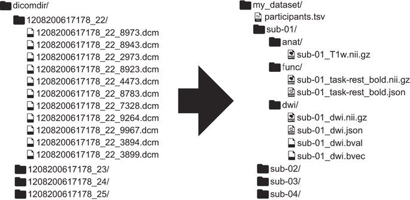
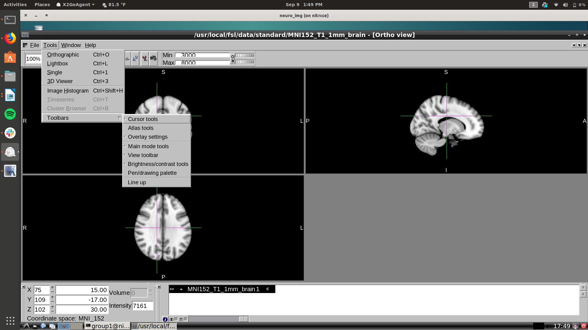
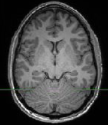
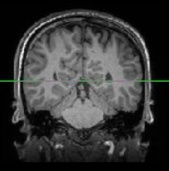
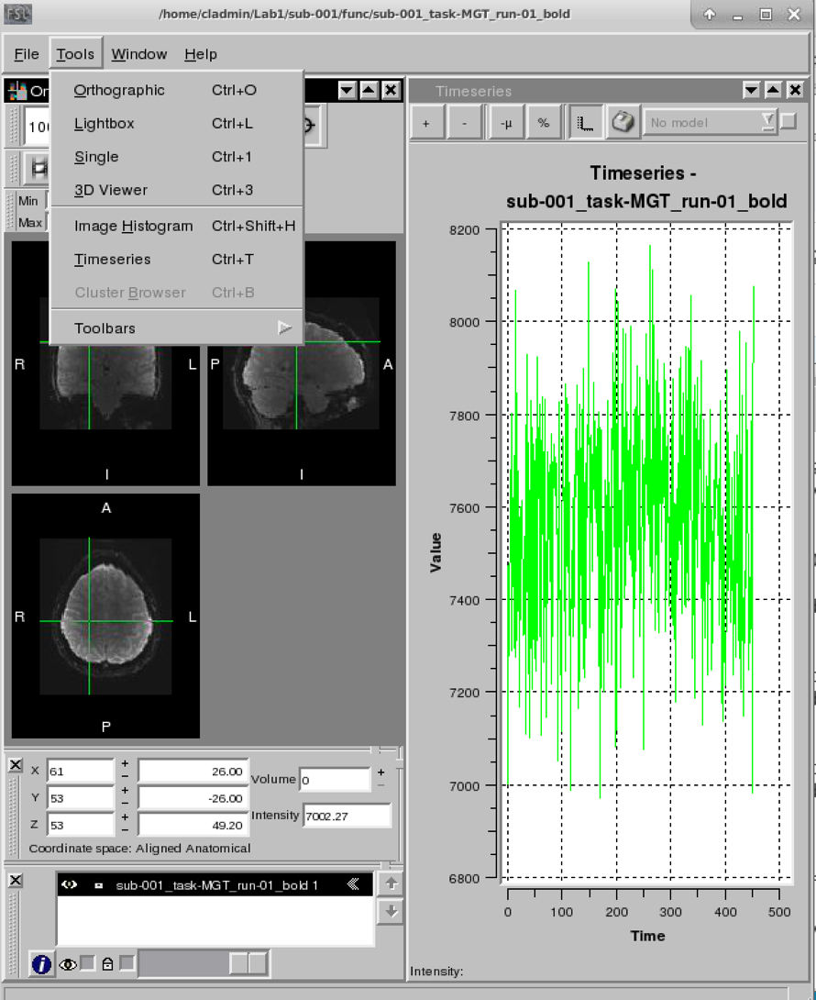
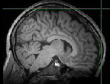

# Lab 1: Exploring Brain Anatomy

## Learning Objectives
By the end of this lab, you should:

- Know techniques for loading and viewing MRI and fMRI data
- Know how to measure the approximate size and shape of the adult human brain
- Know the relation between gray and white matter
- Know the locations of some major anatomical landmarks

---

## Introduction
The human brain is incredibly complex. Weighing only about 3 pounds (1.3 kg), it contains approximately 100 billion neurons and several times as many supporting cells. MRI cannot resolve individual neurons—it operates on the millimeter scale—so we use it to study the gross anatomical structure of the brain.

---

## Data Sets Used
Most datasets in this course use the Brain Imaging Data Structure (BIDS): https://bids.neuroimaging.io/

Each subject’s data are in a folder labeled `sub-##`, with `anat/` for anatomical scans and `func/` for 4D BOLD scans.

Images are in NIfTI format (`.nii` or `.nii.gz`), with accompanying `.json` files containing scan metadata.



---

## 1. Viewing the Brain

You’ll load and explore two types of images:
- **Anatomical images** (T1- or T2-weighted)
- **Functional images** (BOLD contrast)

Use **FSLView**, a tool from the FSL suite that displays 3D and 4D brain images.

### Load Anatomical and Functional Images
```bash
fslview_deprecated ~/ds001734/sub-001/anat/sub-001_T1w.nii.gz &
fslview_deprecated ~/ds001734/sub-001/func/sub-001_task-MGT_run-01_bold.nii.gz &
fslview_deprecated ~/ds003745/sub-104/anat/sub-104_T1w.nii.gz &
fslview_deprecated ~/ds003745/sub-104/anat/sub-104_T2w.nii.gz &
```

Alternative (using GUI):
1. Run `fslview_deprecated`
2. Click `File → Open`
3. Select a brain image

You can also compare images across subjects:
```bash
fslview_deprecated ~/ds003745/sub-137/anat/sub-137_T1w.nii.gz &
fslview_deprecated ~/ds003745/sub-137/anat/sub-137_T2w.nii.gz &
```


### Display the MRI Data
Open each dataset in its own FSLView window.

**Q1:** What is similar about the T1 and T2 axial images?

**Q2:** What differences do you notice between the two?

---

## 2. Using FSLView to Look at Anatomy

Open a standardized T1 template:
```bash
fslview_deprecated ~/fsl/data/standard/MNI152_T1_0.5mm.nii.gz &
```

FSLView allows navigation in 3D space:
- **X** = left–right (sagittal)
- **Y** = anterior–posterior (coronal)
- **Z** = inferior–superior (axial)
- Time = 4th dimension (for fMRI)

Change views using coordinate boxes or the mouse. Reference space is MNI (Montreal Neurological Institute) with origin at 0,0,0.



---

## 3. Using FSLView to View Changes Over Time

Functional MRI (fMRI) tracks changes in voxel intensity over time.

To view a voxel's time course:
1. Click a voxel in the functional image
2. Go to `Tools → Timeseries`

Try exploring different voxels to compare time series activity.



---

## 4. Measuring the Brain

Navigate to the subject’s anatomy folder:
```bash
cd ~/ds001734/sub-001/anat/
fslstats sub-001_T1w.nii.gz -V
```
This reports:
- Total number of non-zero voxels
- Voxel size in mm³

Multiply to estimate total brain volume.


---

## 5. Finding the Gray/White Matter Boundary

Gray matter appears **darker** than white matter on T1-weighted scans.
You can estimate a cutoff value between them in two ways:

### A. Manually (via voxel clicking)
Click voxels that appear to be gray or white matter and note their intensities.

### B. Histogram-based
Use the histogram tool:
`Tools → Image Histogram`

Look for two small peaks (gray and white matter) beyond the large air peak near zero. Estimate their midpoint.

You can also set intensity ranges under `Options → Set Intensity Range`.



---

## 6. Identifying Anatomical Locations

Use the standardized MNI image:
```bash
fslview_deprecated ~/fsl/data/standard/MNI152_T1_0.5mm.nii.gz &
```

Enable the atlas toolbar:
`Tools → Toolbars → Atlas Tools`

Then:
- Click `Structures...`
- Select **Harvard-Oxford Cortical Atlas**
- Enable **Locate Selected Structure** and **Preview Selected Structure**
- Click a region name (e.g., Frontal Pole)

This highlights the voxel most likely associated with the structure.



---

## Summary Questions

**Q1.** Compare the functional and anatomical images. What stands out?

**Q2.** Set Z=21 for `sub-001_task-MGT_run-01_bold.nii.gz` and Z=55 for `sub-001_T1w.nii.gz`. What are the differences?

**Q3.** How many volumes are in the anatomical vs. functional scan? What do functional volumes represent?

**Q4.** What is the size of `sub-001_T1w.nii.gz` in voxels, and the approximate brain volume?
- X = ____
- Y = ____
- Z = ____

**Q5 (challenge).** Estimate the number of voxels in white/gray matter using histogram-based thresholding and `fslstats`.

**Q6.** In `sub-001_task-MGT_run-01_bold.nii.gz`, find voxel (43,35,8). Use the Timeseries tool to describe its activity, then repeat for a voxel in visual cortex.



**Q7.** Label each view:
- X =
- Y =
- Z =

**Q8.** Why might researchers prefer one anatomical view over another?

**Q9.** Using the MNI brain and atlas, estimate coordinates for these regions:

| Region                      | X     | Y     | Z     |
|----------------------------|-------|-------|-------|
| Inferior Frontal Gyrus     |       |       |       |
| Middle Frontal Gyrus       |       |       |       |
| Superior Frontal Gyrus     |       |       |       |
| Inferior Temporal Gyrus    |       |       |       |
| Middle Temporal Gyrus      |       |       |       |
| Superior Temporal Gyrus    |       |       |       |
| Occipital Pole             |       |       |       |
| Temporal Pole              |       |       |       |
| Frontal Pole               |       |       |       |
| Postcentral Gyrus          |       |       |       |
| Lingual Gyrus              |       |       |       |
| Orbital Frontal Gyrus      |       |       |       |
| Left Thalamus              |       |       |       |
| Right Hippocampus          |       |       |       |
| Right Accumbens            |       |       |       |
| Left Pallidum              |       |       |       |
