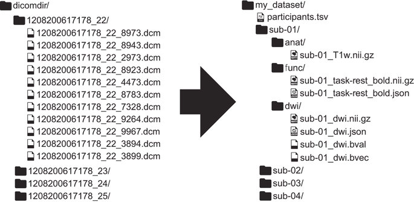
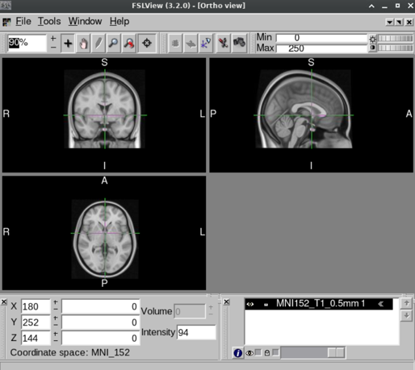
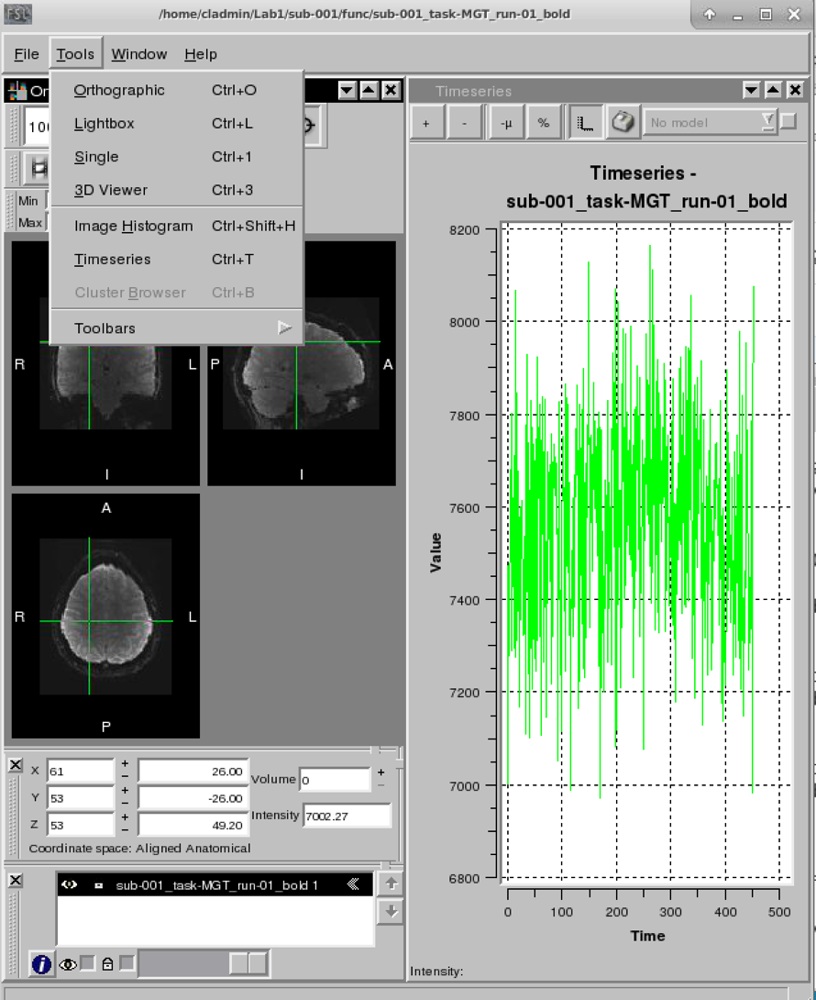
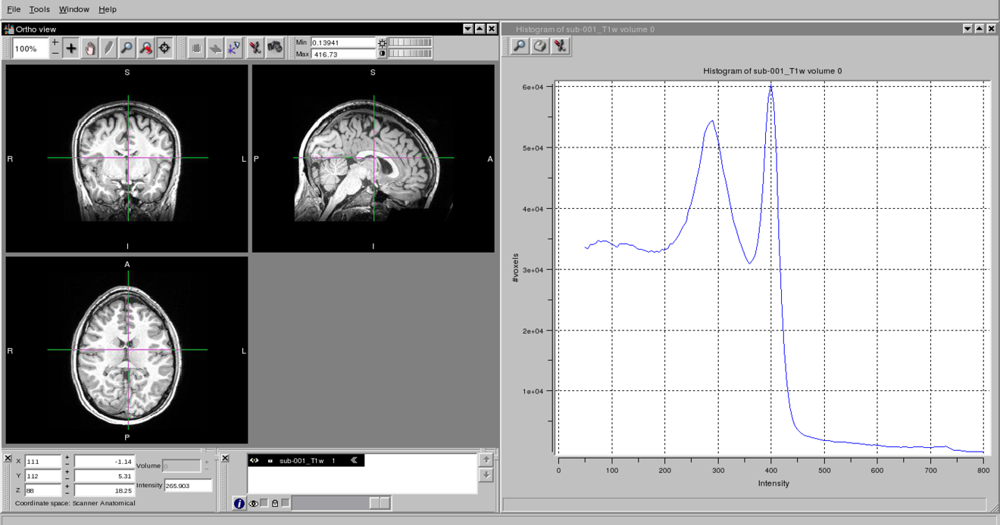
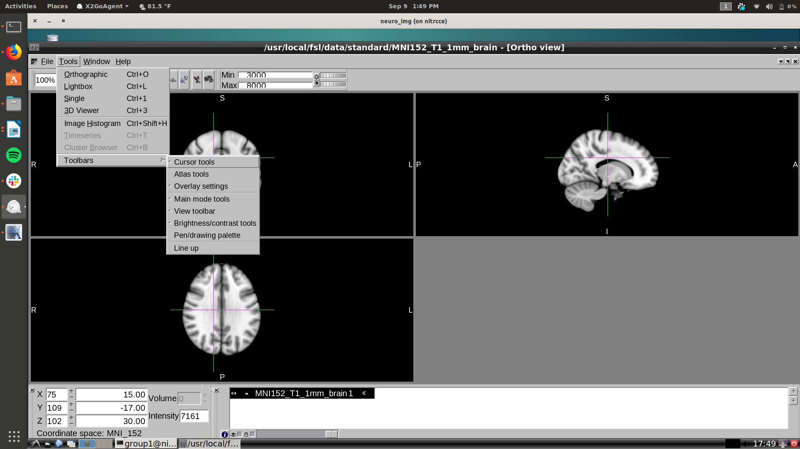
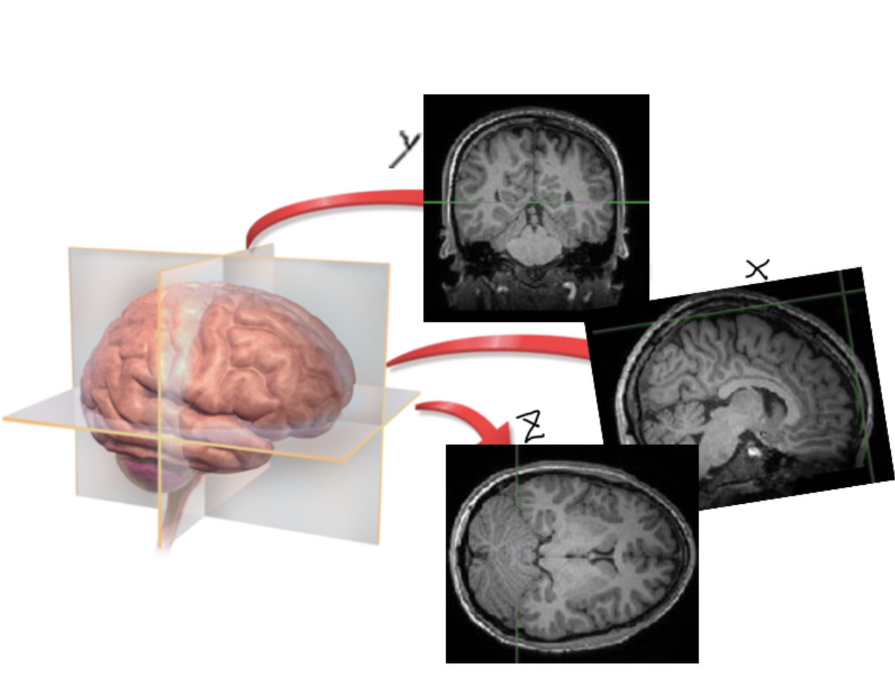

# Lab 1: Exploring Brain Anatomy

**Learning Objectives**

This week's exercises will let you explore the anatomical organization
of the brain to learn some of its basic properties, as well as the
location of different structures. By the end of the lab, you should:

- Know techniques for loading and viewing MRI and fMRI data
- Know how to measure the approximate size and shape of the adult human
  brain
- Know the relation between gray and white matter
- Know the locations of some major anatomical landmarks.

**Introduction**

- The human brain is incredibly complex; weighing only about 3 pounds
  (1.3kg) in the adult human, the brain contains approximately 100
  billion neurons and perhaps several times as many supporting cells.

- While understanding the basic properties of these neurons and their
  connections is critical for neuroscience, MRI operates on too coarse
  of a spatial scale to study neurons directly. Instead, MRI
  investigates the gross anatomy of the brain, examining structure at
  the level of millimeters to centimeters. For comparison, neurons are
  on the order of a few tens of micrometers in size.

**Data Sets Used**

 

Most if not all of the datasets in the
course will be in the Brain Imaging Data Structure (B.I.D.S.)
[[https://bids.neuroimaging.io/]{.underline}](https://bids.neuroimaging.io/)
.

This makes files and folders easy to navigate. Each subject will have
all of their data underneath a directory labeled "sub-##". Beneath that
there will be one or more folders describing the type of scan, typically
"anat" for 3D anatomical scans and "func" for 4D BOLD scans.

Each image is in a nifti file format ending with .nii or .nii.gz and
accompanied with a similarly named JSON file containing the meta-data of
the scan.

## 1. Viewing the brain 

You should understand how to load and view two types of data,
**anatomical images** and **functional images**. Anatomical images are
high-resolution images that provide information about the organization
of brain anatomy. They are usually sensitive to a tissue contrast
parameter like T1 or T2, or to the density of protons of a tissue
type. Functional images are usually of lower resolution, but provide
information about the changes in brain function over time. Most
functional images generated by fMRI experiments are sensitive to
blood-oxygenation-level-dependent (BOLD) contrast.

There are several freely distributable or commercial programs available
for viewing brain images collected from an MRI scan, and in this lab you
will be introduced to one such program: **FslView**. FslView is a
program in the FSL (FMRIB Software Library) suite that can be used to
display three-dimensional or four-dimensional data. It also allows
overlaying of one image on top of another[^1].

## 1.1 Loading the MRI data

Load narps (folder ds001734) and srndna-trustgame (folder ds003745) data
using the **fslview** command.

``` bash
fslview_deprecated ~/ds001734/sub-001/anat/sub-001_T1w.nii.gz &

fslview_deprecated ~/ds001734/sub-001/func/sub-001_task-MGT_run-01_bold.nii.gz &

fslview_deprecated ~/ds003745/sub-104/anat/sub-104_T1w.nii.gz &

fslview_deprecated ~/ds003745/sub-104/anat/sub-104_T2w.nii.gz &
```

Alternatively:

- Open fslview by typing fslview_deprecated in the command line

- Click on 'file'

- Click on 'Open'

- Select brain image that you'd like to open

You can also take a look at sub-137. Take some time to notice any
anatomical differences. One is significantly older than the other can
you guess which is older/younger?

``` bash
fslview_deprecated ~/ds003745/sub-137/anat/sub-137_T1w.nii.gz &

fslview_deprecated ~/ds003745/sub-137/anat/sub-137_T2w.nii.gz &
```

## 1.2  Display the MRI data

Display each of the datasets in a separate **fslview** window.

**Q1: Look at the different axial images (T1, T2). What is similar about
the data?**

**Q2. What is different about the data?**

**\*\* At this point, you should begin working on your own. The TAs
and/or instructor will be available for help as needed. \*\***

## 2.  Using FslView to look at anatomy

Now we are going to open a standardized (or "normalized", which is a
concept you'll learn more about later in the course) T1 template
embedded in the image viewer.

``` bash
fslview_deprecated ~/fsl/data/standard/MNI152_T1_0.5mm.nii.gz &
```



You will be using FslView frequently in future labs, so we will begin by
describing its various features.

- FslView allows data to be viewed in 3- or 4-dimensional space. The
  brain itself has three dimensions, usually expressed as X (left to
  right), Y (anterior to posterior), and Z (superior to inferior). The
  fourth dimension is time. Anatomical data usually have 3 dimensions;
  functional data usually have 4 dimensions.

- By viewing data in more than one dimension at a time, you can gain a
  better appreciation for important aspects of brain structure. The
  importance of looking at your data cannot be stressed enough. Take
  some time at this point in the lab to play with the different views of
  the brain. Ask yourself questions about its organization, and try to
  see what different views look like.

- Note there are three different angles! In the bottom left window, the
  brain appears as if you were looking at it from above, known as an
  **axial** view. In the top left window, the brain appears as it would
  from the front, known as a **coronal** view. And, in the top right,
  the brain appears as it would from the side, known as a **sagittal**
  view.

- To traverse the brain and view different slices, use your mouse or the
  X, Y, Z coordinates at the bottom left. To traverse the time-dimension
  and view the brain at different timepoints, use the Volume section. We
  will reference space using the MNI coordinates circled in the view
  above in red. These coordinates start at 0,0,0 with the anterior
  commissure.

- To the left of the MNI coordinates is the slice number. x refers to
  slice from a sagittal view, increase in number suggesting slices
  moving from right to left; y refers to slice from a coronal view,
  increasing in number suggesting slices moving from posterior to
  anterior; and z refers to slice from an axial view, increase in number
  suggesting slices moving from inferior to superior. Change the numbers
  here to view different slices from different views.

## 3.  Using FSLview to view changes over time

Because functional MRI data enable tracking of changes in **voxel**
(think 3D pixel) intensity, we can use relative change over time to
identify areas of the brain associated with particular functions. This
can be done with the functional data set.

Evaluating the time course of a voxel can be done easily. **Go to the
window for the Functional data set
(sub-001_task-MGT_run-01_bold.nii.gz). Click on any voxel within the
brain using your mouse, then click Tools→ Timeseries**. A window will pop
up with a graph of the time course of fMRI activity in that voxel. **If
you click on a new voxel in the volume, a new time course will appear to
replace the old one. Examine the time courses of a number of different
voxels to get a feel for what time series data look like.**



## 4. Measuring the brain

An important use of MRI is measuring the brain. For example, researchers
studying hippocampal changes with a given disorder may use MRI to
measure its volume in patient and control groups. Anatomical images can
have spatial resolution of about 1mm, so they can be very useful for
fine measurement. Here, we estimate the volume of the brain's using
*fslstats*.

``` bash
cd ~/ds001734/sub-001/anat/
fslstats sub-001_T1w.nii.gz -V
```

<u>Tip</u>: almost all commands (or tools) in FSL will show you
exactly how to use them, including other options if you type in the
command without any inputs. Take a look at all the things *fslstats* can
do for you.

## 5. Finding the Gray / White Boundary

A common distinction between types of tissue in the brain is between
"gray matter" and "white matter". Gray matter refers to a relatively
thin (5mm) layer of cells on the outer surface of the brain. Most
information processing is thought to occur in the gray matter. White
matter refers to the axonal connections between different parts of the
brain that transfer signals from one location to another. As their names
imply, gray and white matter appear dark and light, respectively, on
physical sections through the brain. They also appear dark and light on
T~1~-weighted images, like our anatomical. Here, you will use
intensity-based segmentation to partition the brain into gray and white
matter.

Since gray matter appears darker than white matter on the sub-001_T1w
images, we can estimate a cut-off value that will best separate the two
types of tissue. There are two ways to do this in fsl.

First, you can do it easily (albeit roughly) "by hand" (zooming in would
make them easier to distinguish). **Select a number of points that should
be in white matter, and a number of points that should be in gray matter
(by visual appearance). Then, by clicking on these, determine what
intensity is typical for gray matter and what range is typical for white
matter.** A similar method is to select a point in gray matter and move
the cursor voxel by voxel until you cross completely into white matter,
making a note of what values are at the transition location.

Second, you can find the needed values by creating a histogram. FslView
will create a histogram for you with the **Tools→ Image Histogram.**

You can likely see a plot that has several peaks. The very large peak
near zero reflects the many voxels in the air around the head that have
minimal signal. To the right will be a distribution with two much
smaller peaks; these correspond to gray and white matter. Note that
there are many voxels that have intermediate values between these peaks;
these correspond to voxels that actually contain both gray and white
matter (i.e., those on the boundary between them). You can estimate the
cut-off value by finding the midpoint between these peaks.

You can view change the min/max intensity to only look at white matter
**(click on 'options', change "set intensity range")**

Note that this cut-off value depends upon many factors, including
scanners, subjects, pulse sequences, and reconstruction approaches. What
is important is not the absolute number, but the relative difference
between the tissues (i.e., their contrast).




## 6. Identifying Anatomical Locations

Our final exercise will use identify key anatomical locations within the
standardized structural MRI image you opened (**MNI152_T1_0.5mm.nii.gz**).
When doing fMRI studies, it is important to gain a working knowledge of
brain anatomy, for several reasons. Researchers should be able to
accurately and consistently identify areas of activity, to best develop
and test brain-based hypotheses. Without a good knowledge of anatomy, it
is difficult to read the neuroimaging literature or to converse with
other investigators about experimental data. Nevertheless, learning
neuroanatomy is hardly a simple task. We urge students to explore the
suggested readings and other references provided in Chapter 2 to help
with the identification of these locations.

The specific anatomical locations are listed at the bottom of these
exercises.

To identify brain regions using FslView, simply scroll through the
slices as needed and click on the desired location to get its
coordinates. We recommend using the "3 Orthogonal Planes" view, for best
visualization of regions.

To make this easier go to **Tools→ toolbars→ atlas tools.**



When the atlas window appears click

**Structures... → Select appropriate atlas (i.e., Harvard-Oxford
Cortical atlas) → Select Both options (Locate selected structure & Preview
Selected structure) → click the name of the desired structure （e.g.,
Frontal Pole)**

The voxel marked by the cross has been ID'd as belonging to the
indicated area in a larger percentage of
individuals.


## Summary of Exercises 

**Questions:**

Q1. Visually compare and contrast the functional and anatomical images.
What do you notice?

Q2. Set Z=21 for functional image sub-001_task-MGT_run-01_bold.nii.gz,
set Z=55 for anatomical image sub-001_T1w.nii.gz ,and display them side
by side. These two slices represent approximately the same axial level
of the brain. What are the differences between the images you can note?

Q3. How many volumes are in the anatomical scan? How many volumes make
up the functional image? What do these volumes represent in the
functional image?

Q4: Find the size of each dimension of the sub-001_T1w.nii.gz in voxels
and the approximate volume

Approximate size of the sub-001_T1w.nii.gz brain (voxels):

X \_\_\_\_ Y \_\_\_\_\_\_ Z \_\_\_\_\_\_

Q5 (challenge question): Count how many voxels are in the white/gray
matter in this T1w image? *Hint: Estimate of threshold for white/gray
matter using your histogram and then use the **fslstats** tool to count
the number of voxels within a certain intensity range.*

Q6: Find in sub-001_task-MGT_run-01_bold.nii.gz, the voxel coordinates
(43,35,8). Describe the time course of its activation use time-series
tool (visible when using the "3 Orthogonal Views" orientation). Then,
identify a voxel in the visual cortex and describe its activation.

Q7: Below you will find drawings of the brain in different views. Write
each view's name.


X =

Y =

Z =

Q8: Why might brain researchers prefer one view of the brain or another?
Can you think of any potential reasons?

Q9: In MNI152_T1_0.5mm.nii.gz, use MNI Coordinates and the Harvard
Oxford Atlas to approximate locations of the standard MNI brain (see
command below).

```bash
fslview_deprecated \~/fsl/data/standard/MNI152_T1_0.5mm.nii.gz &
```

Cortex

... Inferior Frontal Gyrus: X \_\_\_\_\_ Y \_\_\_\_\_ Z \_\_\_\_\_

... Middle Frontal Gyrus: X \_\_\_\_\_ Y \_\_\_\_\_ Z \_\_\_\_\_

... Superior Frontal Gyrus: X \_\_\_\_\_ Y \_\_\_\_\_ Z \_\_\_\_\_

... Inferior Temporal Gyrus: X \_\_\_\_\_ Y \_\_\_\_\_ Z \_\_\_\_\_

... Middle Temporal Gyrus: X \_\_\_\_\_ Y \_\_\_\_\_ Z \_\_\_\_\_

... Superior Temporal Gyrus: X \_\_\_\_\_ Y \_\_\_\_\_ Z \_\_\_\_\_

...Occipital Pole : X \_\_\_\_\_ Y \_\_\_\_\_ Z \_\_\_\_\_

...Temporal Pole: X \_\_\_\_\_ Y \_\_\_\_\_ Z \_\_\_\_\_

...Frontal Pole: X \_\_\_\_\_ Y \_\_\_\_\_ Z \_\_\_\_\_

...Postcentral Gyrus: X \_\_\_\_\_ Y \_\_\_\_\_ Z \_\_\_\_\_

... Lingual Gyrus: X \_\_\_\_\_ Y \_\_\_\_\_ Z \_\_\_\_\_

... Orbital Frontal Gyrus: X \_\_\_\_\_ Y \_\_\_\_\_ Z \_\_\_\_\_

Sub-Cortex

...Left Thalamus: X \_\_\_\_\_ Y \_\_\_\_\_ Z \_\_\_\_\_

...Right Hippocampus: X \_\_\_\_\_ Y \_\_\_\_\_ Z \_\_\_\_\_

...Right Accumbens: X \_\_\_\_\_ Y \_\_\_\_\_ Z \_\_\_\_\_

...Left Pallidum: X \_\_\_\_\_ Y \_\_\_\_\_ Z \_\_\_\_\_

[^1]: We also recommend other free programs like MRIcroN and MRIcroGL,
    which can be found using Google.
