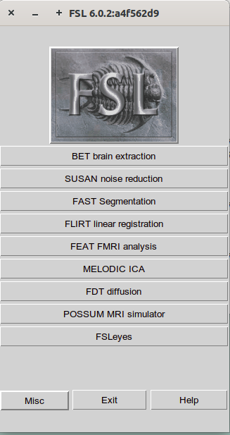
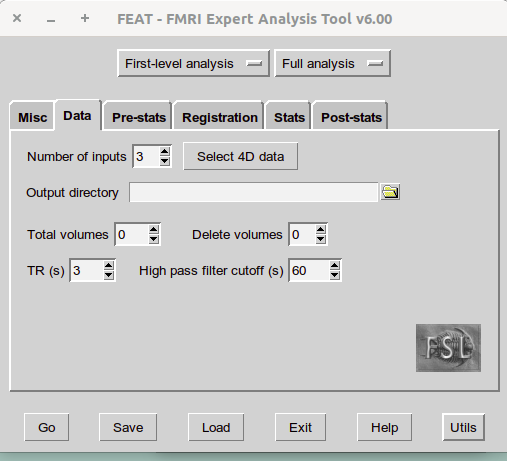

**Lab 3: Preprocessing fMRI data in FSL**

**Learning objectives:**

By now, you should be comfortable

- Logging into your Azure Lab account

- Navigating a **B**rain **I**maging **D**ata **S**tructure (BIDS)

- Use fslview_deprecated & to view and explore MRI images

This week's exercises will let you explore the FMRI Expert Analysis Tool
(FEAT) to learn steps to preprocess neuroimaging data. By the end of the
lab, you will be expected to:

- open FSL & navigate the FMRI Expert Analysis Tool (FEAT)

- Understand & apply:

  - motion correction

  - Slice timing correction

  - Brain Extraction: Functional & Anatomical

  - Spatial Smoothing

  - Intensity Normalization

  - Temporal filtering

You should follow the steps on this lab sheet carefully and answer the
questions.

**\*\* At this point, you should begin working on your own. \*\***

**\*\* The TAs or instructor will be available for help as needed.
\*\***

# **1.1: Open FEAT**

Data for this lab are contained in the directory

~/ds003745/

Open a terminal and make a directory for all your output for this lab:

```bash
mkdir -p ~/Lab_3/OUTPUT
```

To open feat type the fsl command into the terminal and click **FEAT
FMRI analysis**

**fsl &**

or type the feat command into the terminal (note that commands are case
sensitive for "F")

**Feat &**

## **1.2 Navigating Feat**{width="2.3333333333333335in" height="0.2708333333333333in"}{width="2.3333333333333335in" height="0.2708333333333333in"}{width="2.5989588801399823in" height="4.906055336832896in"}{width="4.132315179352581in" height="3.7656255468066493in"}{width="2.3333333333333335in" height="0.2656255468066492in"}{width="3.088542213473316in" height="0.40625in"}

Feat gives us all of the tools we need to perform simple analyses of
FMRI data from preprocessing through, level 1, and higher-level
analyses. Click through the options at the top of the page to see what
is available. Note the tabs that are no longer available when you make
certain selections. For now we are just going to explore the
preprocessing steps so set your top buttons to\...

1: **First-level analysis** 2: **Preprocessing**

{width="5.017543744531934in"
height="3.7052635608048994in"}

**Q1. What options become unavailable to you limiting to preprocessing
only? Why might you want to separate preprocessing from other aspects of
analyses?**

Go to the **Misc** tab let's **& turn on Progress Watcher**. Note that
the stony-grey box is unselected, and the yellow box is selected

{width="3.1666666666666665in"
height="2.8977351268591427in"}

**Balloon help**: is a tool that will explain the various ptions
available to you by hovering your mouse over it. Try it with a few
options on the **Misc** page.

**Q2. When you use the Delete Volumes option in the Data tab, does the
design matrix start during or after the deleted scans? Although we
haven't covered statistics yet, what problem do you think could arise
from not carefully considering this parameter? (Hint: use the Balloon
help)**

## **2.1 Selecting your Data**

## **Click "Data" tab and change the following settings**{width="2.3333333333333335in" height="0.2656255468066492in"}{width="0.9843755468066492in" height="0.2708333333333333in"}{width="4.132315179352581in" height="3.7656255468066493in"}

- Number of Inputs: 1

- Select 4D data:
  ~/ds003745//sub-104/func/sub-104_task-trust_run-01_bold.nii.gz

Output directory: make sure you are outputting to the directory
(**~/Lab_3/OUTPUT**) you have created

**Q3. After selecting the appropriate 4D Bold Scan, FEAT detects the
Total Volumes and TR for you. What are they for this file?**

## 

## **2.2 Pre-Stats** 

**2.2.1 Brain Extraction/ Skull Stripping:**

Most FSL programs can be run from the command-line without using a GUI,
by typing fully lowercase names (e.g., bet). Many programs also have a
GUI, which can be started via the fsl mini-GUI (type fsl) or by typing a
capitalized version of the command name (e.g. Bet).

(<https://open.win.ox.ac.uk/pages/fslcourse/practicals/intro2/index.html>
)

Using the Bet GUI, set the input file to **sub-104_T1w.nii.gz**; use the
right-hand file selector button rather than typing this in by hand as it
minimizes the chances of errors. Turn on various optional outputs (brain
extracted image, binary brain mask and skull surface image - see
Advanced Options tab) but leave the other settings as they are. Note
that the GUI suggests the default output name structural_brain.

When done click on Go to run BET and then exit the GUI once it\'s done.
You will see that when you pressed Go the actual command carried out was
printed in the terminal; many of the FSL GUIs will do this, in order to
help you see what\'s actually going on. Also, in the terminal you will
see Finished appear once BET has finished running (you may need to hit
return to get a visible prompt back after seeing \"Finished\").

BET can also be run from the command line. In later steps we will want a
skull stripped anatomical. Use the following command to create a skull
stripped anatomical.

**bet ~/ds003745/sub-138/anat/sub-138_T1w.nii.gz
~/ds003745/sub-138/anat/sub-138_T1w_brain**

[Under pre-stats tab:]{.underline}

Uncheck all options except for BET brain extraction and hit go

{width="4.707028652668416in"
height="4.2657436570428695in"}

Then make sure you choose the input file under the registration tab
before hitting go

Here we use the standard input of **MNI152_T1_2mm_brain**

Feat creates a lot of output and stores it in a directory with your
output name and .feat at the end. The data we want will be the
filtered_func_data.nii.gz.

**Q4. Use fslview_deprecated & to open the original func data
(sub-104_task-trust_run-01_bold.nii.gz) and leave it open for later use,
and open a separate fslview_deprecated window for the**
filtered_func_data.nii.gz (all the outputs from individual steps of
preprocessing are named filtered_func_data.nii.gz, just in different job
folders) **from BET**. C**ompare the before and after data. What did
this step do and why might that process be important?**

**2.2.2 Motion Correction:**

Return to the Feat GUI. Under the Data tab, change the output name so
that you will be able to tell it apart from just the motion corrected
data.

{width="4.072407042869641in"
height="3.6662084426946633in"}

Uncheck all options except for Motion Correction MCFLIRT and hit go. {width="4.916052055993001in"
height="4.4681911636045495in"}

After hitting go, wait shortly for the output to generate, then again,
look in the new feat directory and look at the filtered_func_data

**Q5. Use fslview_deprecated &to compare the before and after data from
MCFLIRT. (HINT scroll through the volumes or press the movie button).
What did this step do and why might that be important? Did it do a good
job? Why do you think so? (HINT: compare sub-104 and sub-138 run-03)?**

**2.2.3 Smoothing:**

Create a new output under data tab before named something like
2mm_smoothing. Keeping other setting inactivated and select a smoothing
kernel under pre-stats tab of 2 and hit go.

{width="4.988959973753281in"
height="4.551514654418198in"}

Do similar steps for 5mm and 15 mm

**Q6. Use fslview_deprecated & to compare the before and after data
(**filtered_func_data.nii.gz**) from smoothing. Describe the differences
you see for the different smoothing kernels.**

**2.2.4 Temporal Filtering:**

Go back to pre-stats and deselect everything but highpass under temporal
filtering, then rename the output feat folder name again under the Data
tab.

{width="3.835754593175853in"
height="3.4513779527559056in"}

**Q7. Use fslview_deprecated & to compare the before and after data
(**filtered_func_data.nii.gz **) from filtering. (HINT: Use the time
series view). Describe how this preprocessing step changed your data.**

**2.2.5 Registration:**

Rename output folder. Deselect everything under pre-stats. Select the
next tab that says Registration. For main structural select the skull
stripped anatomical that we created earlier with bet. For the
**standard** make sure it says MNI152_T1_2mm_brain.

{width="5.00069772528434in"
height="4.531882108486439in"}The output html page provided in Feat
should show how good we did with Registration. Click Go.

You output this time will include a report in the folder. Open edge and
enter "/home/student/Lab_3/YOURNAMEFORIT.feat/report_reg.html"

{width="6.5in"
height="4.305555555555555in"}

The registration output displays a red outline on top a greyscale image
of another brain. The first shows an average image of fMRI data as the
underlay, and the MNI brain as the red lines.

The outline should trace the boundary of the greyscale image. Also check
whether ventricles and other internal structures are aligned

**Q8. Look at the Feat report and navigate to the registration tab.
Describe what this preprocessing step did to your data. What do the
different groups of brains represent? Did your brain register correctly?
What happens if you run it again without conducting BET on the
structural image?**

**3. FSLUTILS**

**In what follows, we have copied directly from the FSL Course Material
(reference:
<https://open.win.ox.ac.uk/pages/fslcourse/practicals/intro3/index.html>
). We have only updated the data to match what is on your Virtual
Machines.**

**3.1 fslstats**

fslstats is a general tool for calculating various values/statistics
from the image intensities. It is quite flexible but we will just
illustrate some basic uses here. Type fslstats to see the full list of
possible options and brief description of the output. Any combination
and order of options is possible.

Run 

> cd ~/ds003745/sub-104/anat/
>
> fslstats sub-104_T1w.nii.gz -R -r

The first pair of numbers (specified by -R) is the absolute range of the
data - i.e., the min and max intensities. The second pair (-r) is the
\"robust range\" - i.e. the min and max if the outer tails of the
intensity distribution are ignored (this is useful if the data contains
outliers). View the image histogram in fslview_deprecated to see how all
these numbers relate to the histogram.

Run:

> fslstats sub-104_T1w.nii.gz -m -M

The first number is the mean intensity of all voxels in image, whilst
the second is the mean of only the non-zero voxels. The first is much
lower because of all the zero background voxels dragging down the mean.
The second number is a more meaningful mean of the actual within-brain
intensities - view the image and click around inside the brain to see
this.

**3.2 fslsplit**

In this example we will look at a way of splitting up the 4D input image
into its individual 3D images, or volumes, (vol0000, vol0001,
vol0002, etc.):

> cd ~/ds003745/sub-104/func
>
> fslsplit sub-104_task-trust_run-01_bold.nii.gz

To list these new files, do:

> ls vol\*

(note that the \* is expanded by the terminal to fit any characters in
all possible filenames present, and so can be used in any commands, not
just ls, as we will see below). You\'ll see that the counting of the
images starts with 0, and that the number of images should match the
number of timepoints in the original 4D image.

**3.3 fslmaths**

fslmaths is a very general image calculator and can be used to perform a
great variety of manipulations of images. See the (long) usage by just
typing fslmaths. Don\'t worry about understanding it all at this point,
we will illustrate some basic uses here, but be aware that it is a very
general and powerful tool that is worth getting to know.

As a very simple example, we will find the difference between two
consecutive timepoint images (the images are extracted from a functional
dataset, and this difference calculation might be used as part of a
quality assessment). Do this by running:

> fslmaths vol0121 -sub vol0077 imdiff

and view the output (the final argument in that command) in
Fslview_deprecated. Now calculate this as a percent difference image by
running:

> fslmaths imdiff -div vol0121 -mul 100 imdiffpercent

This means: \"take the difference image, divide by the first of the
original images (voxelwise), multiply by 100, and output\". View the
output in Fslview_deprecated, and then use fslstats to calculate its
absolute and robust range - see that the robust range is quite small,
with most change showing up as motion effects round the edge of the
brain.

Make sure that you understand the fslmaths commands above; and note that
in general an \"input\" can be a number instead of an image (the \"100\"
could have been an image name instead, implying 100.nii.gz). This does
not apply to the first input in the command!

# Names: \_\_\_\_\_\_\_\_\_\_\_\_\_\_\_\_\_\_\_\_

# Summary of Exercises 

Q1. What options become unavailable to you limiting to preprocessing
only? Why might you want to separate preprocessing from other aspects of
analyses?

Q2. When you use the Delete Volumes option in the Data tab, does the
design matrix start during or after the deleted scans? Although we
haven't covered statistics yet, what problem do you think could arise
from not carefully considering his parameter? (Hint: use the Balloon
help)

Q3. After Selecting the appropriate 4D Bold Scan FEAT detects the Total
Volumes and TR for you. What are they?

Q4. Use fslview_deprecated & to compare the before and after data from
MCFLIRT. (HINT scroll through the volumes or press the movie button).
What did this step do & why might that be important? Did it do a good
job? Why do you think so?

Q5. Use fslview_deprecated & to compare the before and after data
(filtered_func_data.nii.gz) from BET. What did this step do & why might
that be important? Did it do a good job? Why do you think so?

Q6. Use fslview_deprecated & to compare the before and after data from
smoothing. Describe the differences you see for the different smoothing
kernels.

Q7. Use fslview_deprecated & to compare the before and after data from
filtering. (HINT: Use the time series view). Describe how this
preprocessing step changed your data.

Q8. Look at the Feat report and navigate to the registration tab.
Describe what this preprocessing step did to your data. What do the
different groups of brains represent? Did your brain register correctly?
What happens if you run it again without conducting BET on the
structural image?
