**Lab 4: Running the analysis -- L1 stats**

**Learning Objectives**

We\'ve already covered concepts like the General Linear Model, the BOLD
response, and convolution. Today, you will broadly learn how to perform
individual level stats in FSL (a.k.a., Level 1 or L1 statistics). After
this lab activity, you should be able to do the following:

- Create timing files that describe a design matrix

- Estimate the design matrix and apply contrasts

- Apply corrections for multiple comparisons

- Understand and interpret all FEAT output

*Notes and reminders: First, for this lab, all of the questions are at
the end of the document (none are embedded within the document as we
have done before). Second, you can work with a partner, but everyone is
responsible for submitting the assignment. Third, remember that you
should use the "in-class 'NeuroStars' forum" for asking questions and
sharing knowledge.*

1.  **Downloading some example data**

We will process two data today. Sequence Pilot data and food viewing
data, both from OpenNeuro. Follow the **code and instructions** below to
download the data to your virtual machine.

- Make output directories for lab 4

  - **mkdir \~/Lab_4/**

- Sequence Pilot Data (event-related design):

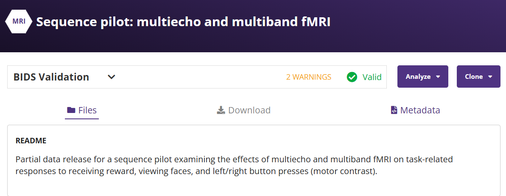{width="5.65625in"
height="2.2059372265966752in"}

- **cd \~; datalad clone
  <https://github.com/OpenNeuroDatasets/ds005085.git>https://github.com/OpenNeuroDatasets/ds005085.git**

- **cd ds005085/**

- **datalad get sub-10015**

- **bet sub-10015/anat/sub-10015_T1w.nii.gz
  sub-10015/anat/sub-10015_T1w_bet.nii.gz \# brain extracting for anat
  image**

- *\[instruction, NOT CODE\]* Use your Edge browser to download both
  event txt files in the
  [link](https://tuprd-my.sharepoint.com/:f:/g/personal/tug87422_temple_edu/EuNE1WWtgZxIihkk6FsRkqEBfDlfK5f_2JZegJvsgKPMOw)
  and move them to **\~/ds005085/sub-10015/func/**

> The data in the sub-10015 folder that we are going to use:

- Anatomical: \~/ds005085/sub-10015/anat/sub-10015_T1w_bet.nii.gz

- BOLD:\~/ds005085/sub-10015/func/sub-10015_task-sharedreward_acq-mb3me1_bold.nii.gz

- Events:

> \~/ds005085/sub-10015/func/\_guess_allRightButton.txt
>
> \~/ds005085/sub-10015/func/\_guess_allLeftButton.txt

- OpenNeuro food-viewing data (block design):

{width="5.75in" height="1.625in"}

in your terminal:

- **cd \~;**

- **datalad clone https://github.com/OpenNeuroDatasets/ds000157.git**

- **cd ds000157/**

- **datalad get sub-01**

<!-- -->

- You also need to download the BIDSto3col.sh file to make three column
  files for the second food viewing dataset (see Section 4)

We'll quickly work through the sequence pilot data (motor example)
together, and then you'll work through the OpenNeuro data on your own.

# **2. Running L1 stats in FEAT:**

# **2.1. Open FEAT:**

1.  Use **Feat &** to call Feat from the terminal.

2.  Keep the default settings of **First-level analysis and Full
    analysis** are selected at the top of the Feat window.

3.  You may want to close 'Progress watcher' under 'Misc' tab

# **2.2. Data tab:**

> Click the **4D data** button & Navigate to
> /home/student/ds005085/sub-10015/func/sub-10015_task-sharedreward_acq-mb3me1_bold.nii.gz
>
> This is the BOLD data that we are analyzing.

4.  Output directory: /home/student/Lab_4/OUTPUT

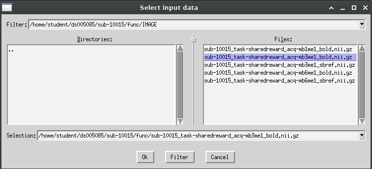{width="6.5in"
height="2.9583333333333335in"}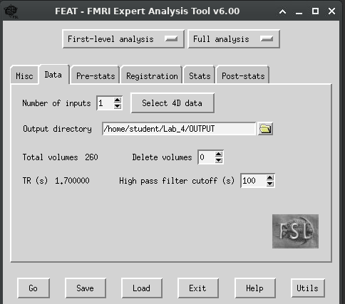{width="5.042369860017498in"
height="4.448536745406824in"}

# **2.3. Pre-stats tab:**

This page allows us to specify the preprocessing that we\'re running.
We\'ll use the same steps from Lab3. This time, select all given
options.

5.  Select:

<!-- -->

a.  **MCFLIRT** for Motion correction

b.  **BET** for brain extraction

c.  **5** for Spatial smoothing FWHM (mm)

d.  **Highpass** for Temporal filtering

e.  **Regular down(n-1,n-2,\...,0)** for Slice timing correction: we
    need to do slice timing correction here since it is an event-related
    design whose slices were collected in descending order.

# 

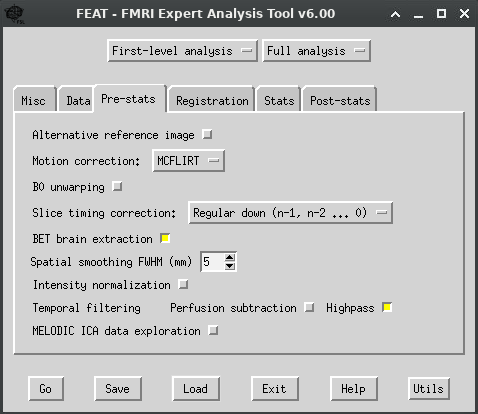{width="4.979166666666667in"
height="4.3125in"}

# **2.4. Registration tab:**

11\. Select the **Main structural image option**

a.  Click on the folder icon & navigate to the
    \~/ds005085/sub-10015/anat/sub-10015_T1w_bet.nii.gz image.

b.  Select the **Normal search** and **BBR options**

Leave default options for **Standard space option.**

The default image should be **MNI152_T1_2mm_brain** with linear
registration options **Normal search** and **12 DOF**.\]

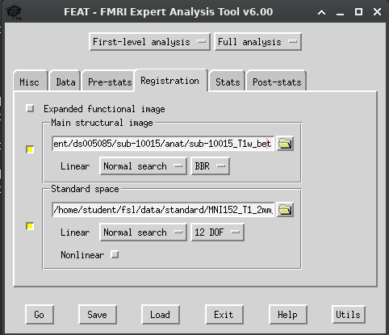{width="5.675597112860892in"
height="4.886663385826772in"}

# **2.5. Stats tab:**

12\. Click **Full model setup**: a General Linear Model Window should
open

a.  Set the **Number of original EVs** to 2.

b.  Click the **EV1** tab and make the following selections:

    i.  **EV name**: Left

    ii. **Basic shape**: Custom (3 column format)

    iii. **Filename**: Select the folder icon and navigate to:
         **/home/student/ds005085/sub-10015/func/\_guess_allLeftButton.txt**

    iv. **Convolution**: Double-Gamma HRF

    v.  **DE-SELECT the option** \"Add temporal derivative\"

(Keep the option \"Apply temporal filtering\")

{width="3.1463768591426073in"
height="4.929885170603675in"}

c.  Click the **EV2** tab and make the following selections:

    i.  **EV name**: Right

    ii. **Basic shape**: Custom (3 column format)

    iii. **Filename**: select the folder icon and navigate to
         **/home/student/**ds005085/sub-10015/func/\_guess_allRightButton.txt

    iv. **Convolution**: Double-Gamma HRF

    v.  **DE-SELECT the option** \"Add temporal derivative\"

(Keep the option Apply temporal filtering)

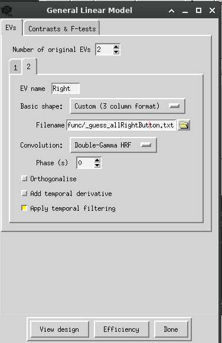{width="3.0317968066491687in"
height="4.684772528433946in"}

13\. Select the **Contrasts & F-tests** tab

a.  Increase the number of contrasts to **5** you can use the up arrow
    key.

b.  For OC1-OC5 reference the table below for the title and EV values.
    Type into the box for **Title** and use the up and down arrows for
    **EV1** & **EV2**.

**(NOTE: OC\'s 2 and 4 include -1)**

Select **Done**. A window displaying the model should popup. It should
look like the following picture. Click the \'**x**\' on the top corner
to close the window.{width="3.800605861767279in"
height="3.9108912948381453in"}{width="2.4583333333333335in"
height="4.395833333333333in"}

# **2.6. Post-stats tab:**

Leave the default settings. Check that they are the same as in the
picture below.

{width="5.46875in"
height="4.0513156167979005in"}

Note "Thresholding" is where cluster-extent and voxel height-based
correction can be selected.

Press **Go** on the bottom left. Copy and paste the output log directory
\"/home/student/Lab_4/OUTPUT_YOUR_TAG).feat/report_log.html" to your
Edge browser to view report.

# **Viewing the output**

The Feat report should automatically appear so you can track the
progress of your analysis. This will take about 15 minutes to complete.

In the meantime, we will review a report of analyses that we have
pre-run for this subject together.

This page tells you exactly what steps have been run. You can review
this page to look for errors and know on what step the error occurred.

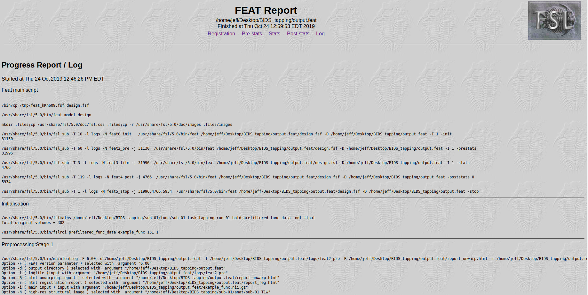{width="6.5in"
height="3.2777777777777777in"}

#  **Registration**

This is the same Registration page that we viewed as part of
pre-processing. We still want to visually check that our registration
was reasonable and didn\'t \"cut out\" large parts of the brain.

Sequence pilot: {width="6.5in"
height="3.4375in"}

**3.2 Pre-stats**

These plots give us a visual representation of the participant\'s
movement throughout the run in terms of **Rotations**, **Translations**,
and **Absolute Displacement**.

Sequence pilot: 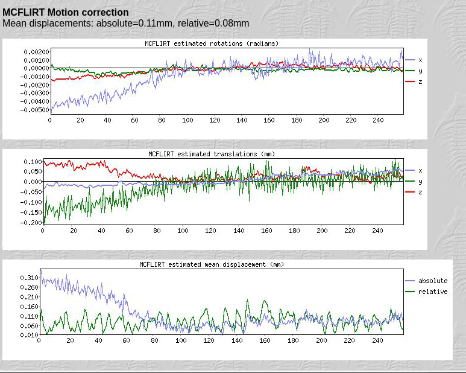{width="6.5in"
height="5.197915573053368in"}

**3.3. Stats**

This page displays the Design Matrix as well as the Covariance & Design
Efficiency matrices.

The Design Matrix is a visual representation of the task we modeled.
Here the participant switched between pressing a button with their Left
hand and then their Right hand.

The Covariance Matrix allows us to see how easy or difficult it will be
to pull apart the effects related to each Independent Variable and an
estimation of the effect size we will need to see each contrast.

Sequence pilot: 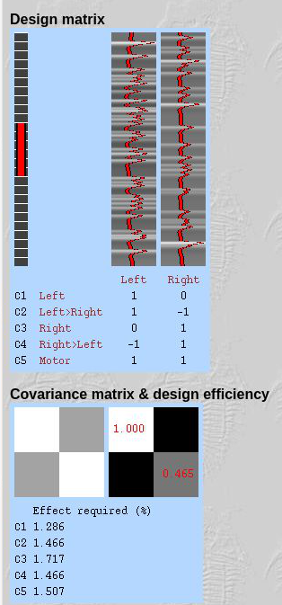{width="3.03125in"
height="6.5in"}

**3.4 Post-Stats**

The Post stats page shows us a picture (in radiological view) of which
areas were significantly active given each specified contrast.

Sequence pilot

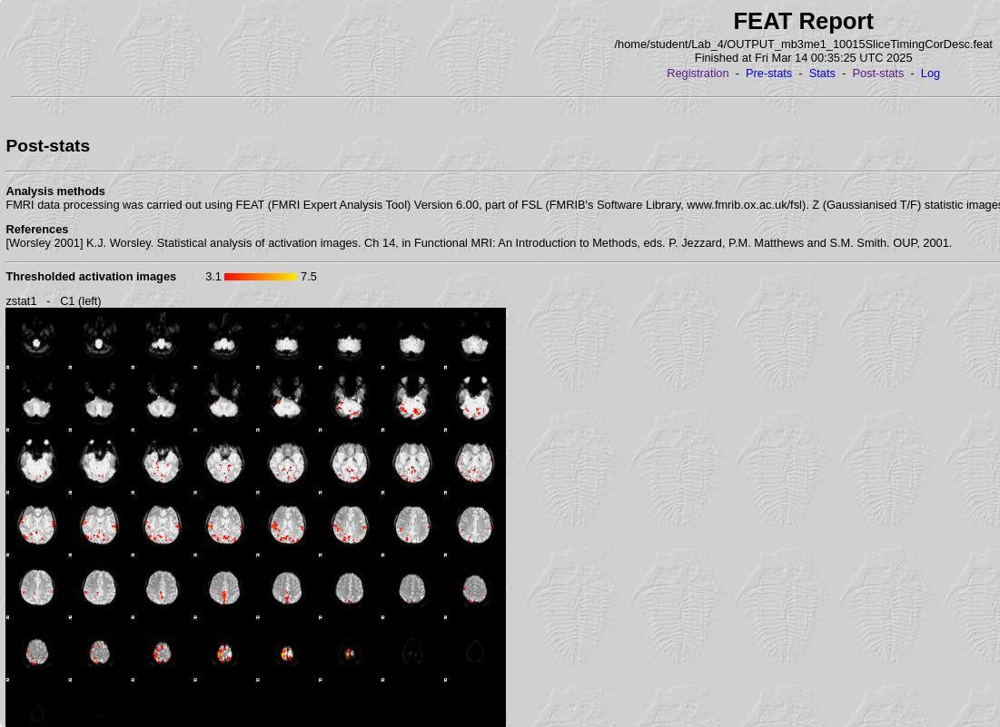{width="6.5in"
height="4.729166666666667in"}

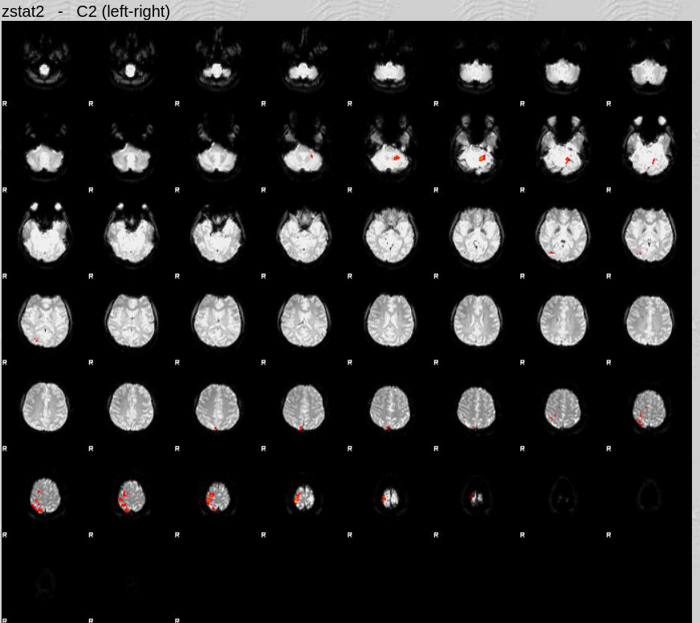{width="4.989583333333333in"
height="4.437849956255468in"}

**You've learnt how to run L1 for event-related designs and read
outputs. Now run L1 for the OpenNeuro food-viewing data (block design)
on your own. You need to first create three column files (see section 4
below).**

4.  **Make three column files.**

FSL uses three column tab-delimited text files describing the timing of
your events. The first column is the onset, the second the duration of
the event, and the third a weighting factor (usually 1, unless you are
testing a hypothesis regarding parametric changes in activation; more on
this later). You need one file for each condition of each run for each
subject before running your analysis. We use **BIDSto3col.sh** script to
extract the 3 column files.

in your terminal:

- **cd \~**

- **git clone <http://github.com/bids-standard/bidsutils.git>**

- **cd bidsutils/BIDSto3col**

- **bash BIDSto3col.sh
  \~/ds000157/sub-01/func/sub-01_task-passiveimageviewing_events.tsv
  sub-01**

you should see three files created:

- sub-01_break.txt

- sub-01_food.txt

- sub-01_nonfood.txt

{width="6.5in" height="0.78125in"}

**Copy the three created .txt files from
/home/student/bidsutils/BIDSto3col/ to \~/ds000157/sub-01/func/**

# Names:\_\_\_\_\_\_\_\_\_\_\_\_\_\_\_\_\_\_\_\_

# Summary of Exercises 

For the exercises, you will focus on your own analyses of ds000157 (see
above). **We will review in class next week, so please submit on time.**

1.  After you create the 3-column files for ds000157, enter them all
    into the FEAT GLM and describe your model.

2.  Using the settings from the demonstration with the finger tapping
    data, what do you observe in terms of brain responses when examining
    contrasts of food \> nonfood and nonfood \> food?

3.  Using the food \> nonfood and nonfood \> food contrasts, compare and
    contrast your results with voxel height thresholding and
    cluster-extent thresholding.

4.  Using the food \> nonfood and nonfood \> food contrasts, compare and
    contrast your results with two smoothing kernels.

5.  Create a temporal misalignment between your data and your model.
    Describe what you did (you should know of two ways to do this now)
    and compare and contrast your results for the food \> nonfood and
    nonfood \> food contrasts.
