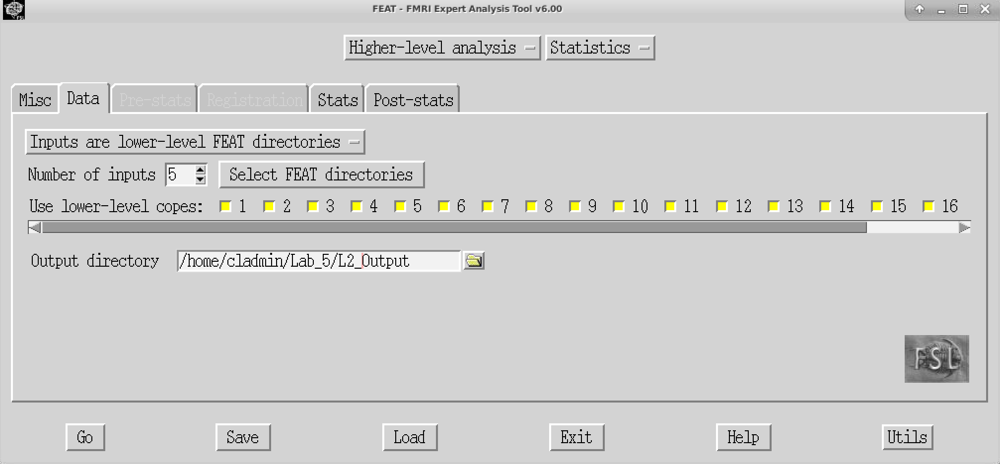
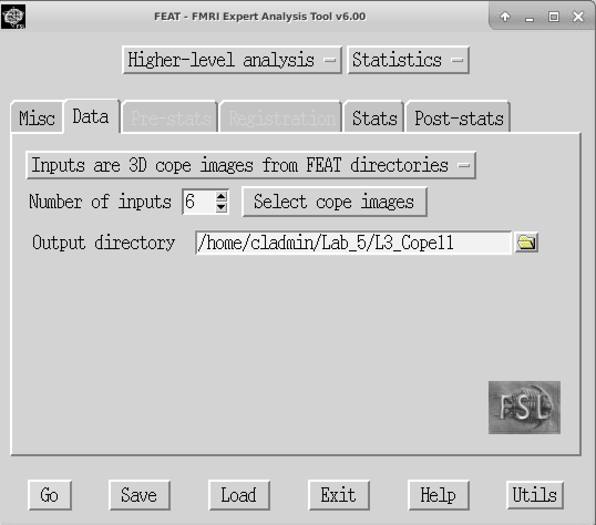
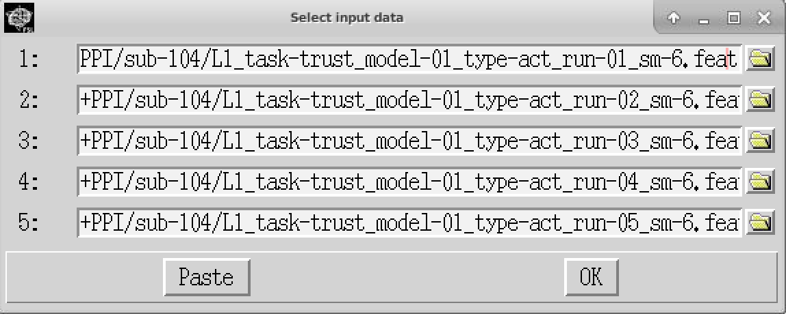
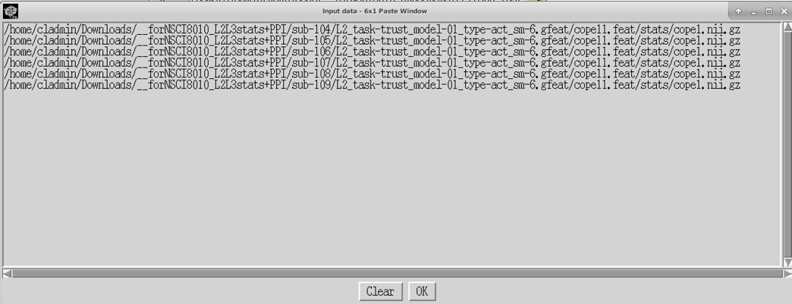

# Lab 5: Running the Analysis – Level 2 & Level 3 Stats

## Learning Objectives
By the end of this lab, you should be able to:
- Run Level 2 (L2) and Level 3 (L3) analyses using FEAT
- Understand and interpret the output from higher-level analyses

In Level 2 analyses, we average activation across runs for each participant. In Level 3, we average activation across participants.

We will be working with the `srndna-trustgame` dataset. Level 1 preprocessing has already been completed for six subjects (each with 5 runs).

---

## Step 1: Set Up Your Working Directory

### 1.1 Create a Folder
1. Open a terminal.
2. Create a folder for this lab:
```bash
mkdir ~/Lab_5
```

### 1.2 Download the Data
This lab uses a preprocessed dataset (~7 GB) hosted on OneDrive.

⚠️ Due to OneDrive’s limitations, **you must download this file manually via your browser**:

[Download Lab 5 Data from OneDrive](https://tuprd-my.sharepoint.com/my?id=%2Fpersonal%2Ftug87422%5Ftemple%5Fedu%2FDocuments%2FTeaching%2FNSCI3000%5FNeuroimagingTopic%5FS25%2F%5F%5Flabs%2F%5F%5FforNSCI8010%5FL2L3stats%2BPPI%2Ezip&parent=%2Fpersonal%2Ftug87422%5Ftemple%5Fedu%2FDocuments%2FTeaching%2FNSCI3000%5FNeuroimagingTopic%5FS25%2F%5F%5Flabs&ga=1)

Once downloaded, move the file into your working directory and unzip it:

```bash
mv ~/Downloads/forNSCI8010_L2L3stats+PPI.zip ~/Lab_5/
cd ~/Lab_5
unzip forNSCI8010_L2L3stats+PPI.zip
```

This will extract Level 1 FEAT directories for runs 1–5 for each subject.

---

## Step 2: Running Level 2 (Within-Subject) Analysis

### 2.1. Launch FEAT
```bash
feat &
```
In the FEAT window:
- Change from **First-level analysis** → **Higher-level analysis**
- Change from **Full analysis** → **Statistics only**



### 2.2. Configure the Data Tab
- Output directory: `/home/student/Lab_5/L2_OUTPUT`
- Number of inputs: **5** (one for each run)
- Click **Select FEAT directories**:
  - For each row, click the folder icon and navigate to the appropriate run-level `.feat` directory:
    - e.g., `sub-104/L1_task-trust_model-01_type-act_run-01_sm-6.feat`
    - Repeat for all five runs.



### 2.3. Configure the Stats Tab
- Set **Mixed effects** to: `Fixed Effects`
- Click **Full model setup**
  - EV1 Name: `Run_Average`
  - For each input, set the EV1 value to `1`


### 2.4. Post-Stats Tab
- Leave default settings
- Click **GO** to begin the analysis

---

## Step 3: Running Level 3 (Group-Level) Analysis

### 3.1. Launch FEAT Again
```bash
feat &
```
In the FEAT window:
- Select **Higher-level analysis**
- Choose **Statistics only**

### 3.2. Configure the Data Tab
- Output directory: `/home/cladmin/Lab_5/L3_Cope11`
- Set input type to: `3D cope images from FEAT directories`
- Number of inputs: **6** (one per subject)
- Click **Select FEAT directories**, then add the `cope11.feat` directory for each subject.

**Pro-tip:** You can use the terminal to quickly list the paths:
```bash
ls -1d `pwd`/sub-1*/L2*-act_sm-6.gfeat/cope11.feat/stats/cope1.nii.gz
```
Then copy the output, and in the FEAT GUI, click **Paste** at the bottom of the selection window.
Use `Ctrl+Y` to paste and press OK.



### 3.3. Configure the Stats Tab
- Mixed effects: `FLAME 1`
- Click **Full model setup**
  - EV1 Name: `Group_Average`
  - Set all EV1 values to `1`
- Under **Contrasts & F-tests**, set:
  - Number of contrasts: `2`
  - Contrast 1: Name = `positive`
  - Contrast 2: Name = `negative`



### 3.4. Post-Stats Tab
- Leave all settings as default
- Click **GO** to begin the analysis

---

## Lab 5 Questions
Answer the following questions in complete sentences.

**Q1.** In Level 2 analysis, why is the "Fixed Effects" option used instead of FLAME 1 when combining runs within a single subject? What assumptions does this method make about the data?

**Q2.** Describe the purpose of the `cope1.nii.gz` file used in Level 3 analysis. What does this file represent, and why is it used as input?

**Q3.** After running your Level 3 (group) analysis, you examined the thresholded z-stat maps. Describe how you determined whether the group-level effect was significant, and what brain regions (if any) showed activation for the contrast of interest.

**Q4.** Why is the use of standard space (e.g., `MNI152_T1_2mm_brain`) important in group-level analyses like Level 3? What problem would occur if this step were skipped?

**Q5.** Explain what the design matrix represents in the Level 3 model. How did you specify it, and what does each row/column correspond to in this context?
