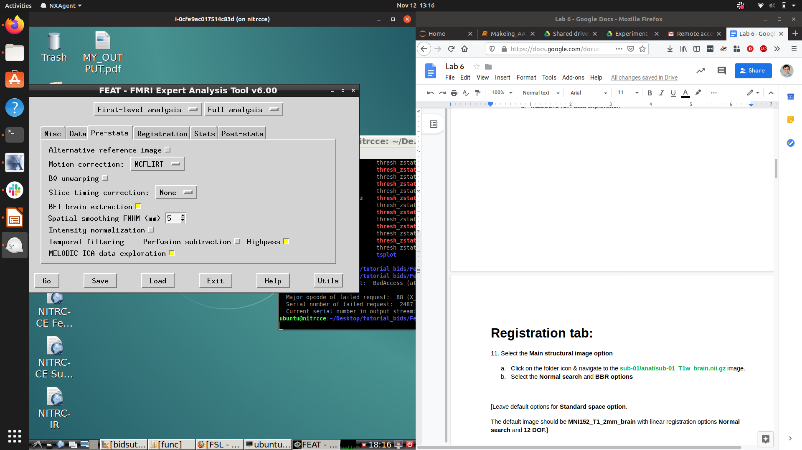

# Lab 6: Psychophysiological Interaction (PPI) Analyses and Independent Component Analysis (ICA)

## Learning Objectives

We’ve covered task-dependent activity analyses in previous labs. In this lab we’re going to look at methods involving *functional connectivity* and *ICA*:

- Make anatomical masks and extract signal for the seed region of PPI  
- Set up and describe the design matrix of PPI with interaction terms and seed regressor  
- Understand and interpret the FEAT report  
- Compare MELODIC ICA data exploration report with FEAT report  

---

## Dataset


**Subject:** Sequence Pilot sub-10015 (used in Lab 4)  
**Anatomical:**  
`~/ds005085/sub-10015/anat/sub-10015_T1w_bet.nii.gz`  
**BOLD:**  
`~/ds005085/sub-10015/func/sub-10015_task-sharedreward_acq-mb3me1_bold.nii.gz`  
**Events:**  
```
~/ds005085/sub-10015/func/_guess_allRightButton.txt  
~/ds005085/sub-10015/func/_guess_allLeftButton.txt  
```

---


## Make Anatomical (i.e., Atlas-Based) Masks

```bash
# Create and enter the folder for the lab
mkdir ~/Lab_6/; cd Lab_6

# Set atlas path
atlas=/home/student/fsl/data/atlases/HarvardOxford/HarvardOxford-cort-maxprob-thr25-2mm.nii.gz

# Open associated XML file to find region index

microsoft-edge ~/fsl/data/atlases/HarvardOxford-Cortical.xml &
```

> Note: FSL indexing is generally 0-based. Add 1 to the index when needed. Use `fslview` to verify ROIs visually.

```bash
# Extract with fslmaths
fslmaths $atlas -thr 26 -uthr 26 -bin JLC

# View the result
fslview_deprecated JLC &
```

---

## Move ROI to Native Space (cf. Lab 4)

```bash

flirt -in JLC.nii.gz \
  -ref ~/Lab_4/YOUR_OUTPUT.feat/example_func.nii.gz \
  -out standardMask2example_func_JLC \
  -applyxfm \
  -init ~/Lab_4/YOUR_OUTPUT.feat/reg/standard2example_func.mat \
  -datatype float
```

**Example:**
```bash
flirt -in JLC.nii.gz \
  -ref ~/Lab_4/OUTPUT_mb3me1_10015.feat/example_func.nii.gz \
  -out standardMask2example_func_JLC \
  -applyxfm \

  -init ~/Lab_4/OUTPUT_mb3me1_10015.feat/reg/standard2example_func.mat \
  -datatype float
```

```bash
# Threshold and binarize to preserve ROI
fslmaths standardMask2example_func_JLC -thr 0.5 standardMask2example_func_JLC
fslmaths standardMask2example_func_JLC -bin standardMask2example_func_JLC
```

---

## Extract Activation from Seed Region


```bash
fslmeants -i ~/ds005085/sub-10015/func/sub-10015_task-sharedreward_acq-mb3me1_bold.nii.gz \
  -m ~/Lab_6/standardMask2example_func_JLC.nii.gz \
  -o sub-10015_task-sharedreward-task_mb3me1_JLC.txt
```

> **Note:** You can also extract from specific clusters using:

```bash
fslmaths cluster_mask_zstat3.nii.gz -thr 2 -uthr 2 cluster2 -bin
```

---


## Setting Up PPI Analyses in FEAT

### 5.1 Open FEAT

```bash
Feat &
```

---

### 5.2 Data Tab

- Load BOLD data:  
  `~/ds005085/sub-10015/func/sub-10015_task-sharedreward_acq-mb3me1_bold.nii.gz`

- Output directory: `/home/student/Lab_6/OUTPUT`

---

### 5.3 Pre-stats Tab

- ✅ MCFLIRT  
- ✅ BET  
- ✅ Spatial smoothing: 5 mm  
- ✅ Highpass filtering  
- ✅ MELODIC ICA: **enabled**


---

### 5.4 Registration Tab

- Structural: `~/ds005085/sub-10015/anat/sub-10015_T1w_bet.nii.gz`  
- Use BBR and standard MNI defaults

---

### 5.5 Stats Tab

Set **Number of EVs** to **5** and configure as follows:




---

### 5.6 Contrasts Tab

Set **10 contrasts**. Fill based on course materials.


---

## Post-Stats Tab

Run analysis and view output:


```bash
firefox /home/student/Lab_6/OUTPUT.feat/report.html &
```

---

## Summary of Exercises

### Q1
What do you expect to see for the **Phys** regressor (C6)? Explain your rationale.

### Q2
How would the interpretation of **PPI_Left** and **PPI_Right** change without the **Phys** regressor? Or without the task regressors?


### Q3
Rerun PPI with a different seed region. How do results differ from the SMA seed?

### Q4
Compare MELODIC ICA outputs to GLM post-stats. What stands out?

### Q5 *(New)*
How does including a **PPI interaction term** change the interpretation of task effects?

### Q6 *(New)*
What are the advantages and limitations of ICA compared to GLM in task fMRI?


---

## Additional Figures


