# Lab 6: Psychophysiological Interaction (PPI) Analyses and Independent Component Analysis (ICA)

## Learning Objectives

We’ve covered task-dependent activity analyses in previous labs. In this lab we’re going to look at methods involving *functional connectivity* and *ICA*:

- Make anatomical masks and extract signal for the seed region of PPI  
- Set up and describe the design matrix of PPI with interaction terms and seed regressor  
- Understand and interpret the FEAT report  
- Compare MELODIC ICA data exploration report with FEAT report  

---

## Dataset

**Subject:** Sequence Pilot sub-10015 (used in Lab 4)  
**Anatomical:**  
`~/ds005085/sub-10015/anat/sub-10015_T1w_bet.nii.gz`  
**BOLD:**  
`~/ds005085/sub-10015/func/sub-10015_task-sharedreward_acq-mb3me1_bold.nii.gz`  
**Events:**  
```
~/ds005085/sub-10015/func/_guess_allRightButton.txt  
~/ds005085/sub-10015/func/_guess_allLeftButton.txt  
```

---

## Make Anatomical (i.e., Atlas-Based) Masks

```bash
# Create and enter the folder for the lab
mkdir ~/Lab_6/; cd Lab_6

# Set brain atlas path
atlas=/home/student/fsl/data/atlases/HarvardOxford/HarvardOxford-cort-maxprob-thr25-2mm.nii.gz
```
Open the atlas' associated XML file to find region index that is associated the Juxtapositional Lobule Cortex (formerly Supplementary Motor Cortex).  

``` bash
microsoft-edge ~/fsl/data/atlases/HarvardOxford-Cortical.xml &
```
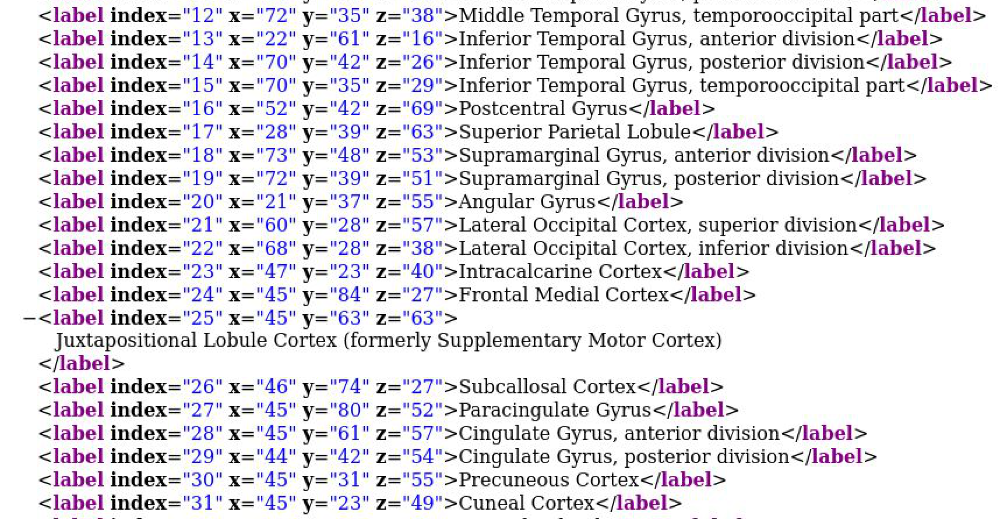
> Note: FSL indexing is generally 0-based. Add 1 to the index for ROI voxel value. 

```bash
# Extract with fslmaths
fslmaths $atlas -thr 26 -uthr 26 -bin JLC

# Use `fslview` to verify ROIs visually.
fslview_deprecated JLC &
```
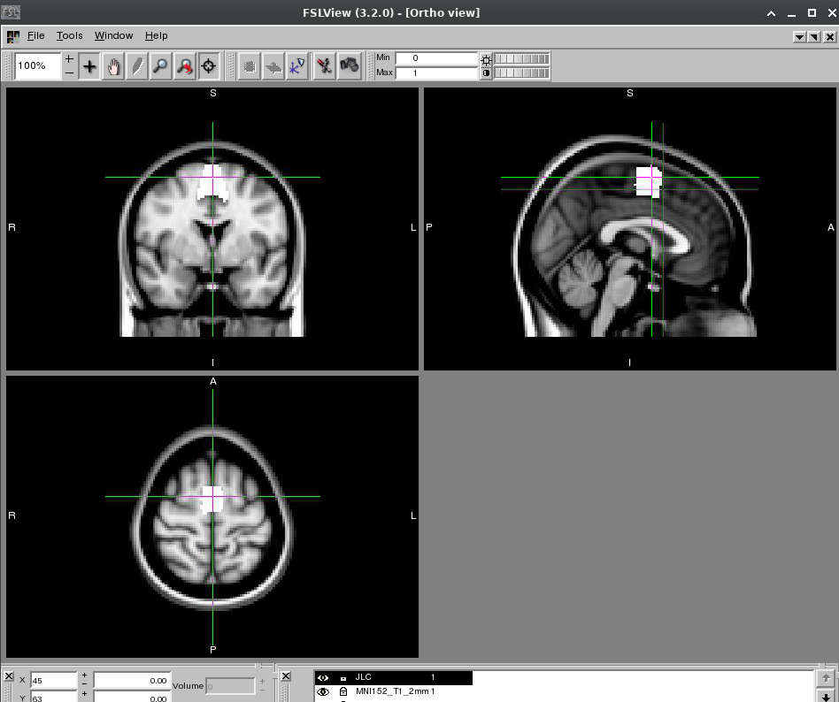

---

## Move ROI to Native Space (cf. Lab 4)

Normalize standard space mask (JLC.nii) into native space using pre-estimated transformation matrix, the output falls in the your Lab_6 directory (reg/standard2example_func.mat). 

> Make sure you use the name you set for your sequence pilot output feat directory in Lab 4 to swap out “YOUR_OUTPUT.feat” in the following command to be able to locate the local space reference image and transformation matrix.
```bash
flirt -in JLC.nii.gz \
  -ref ~/Lab_4/YOUR_OUTPUT.feat/example_func.nii.gz \
  -out standardMask2example_func_JLC \
  -applyxfm \
  -init ~/Lab_4/YOUR_OUTPUT.feat/reg/standard2example_func.mat \
  -datatype float
```

Threshold away voxels of lower intensity
```bash
fslmaths standardMask2example_func_JLC -thr 0.5 standardMask2example_func_JLC
```
Binarize (i.e., make within-ROI voxels 1s and out-ROI 0s) 
```bash
fslmaths standardMask2example_func_JLC -bin standardMask2example_func_JLC
```

---

## Extract Average Activation from Seed Region

```bash
fslmeants -i ~/ds005085/sub-10015/func/sub-10015_task-sharedreward_acq-mb3me1_bold.nii.gz \
  -m ~/Lab_6/standardMask2example_func_JLC.nii.gz \
  -o sub-10015_task-sharedreward-task_mb3me1_JLC.txt
```
The output is the average activation of that region in each volume of your subject across time
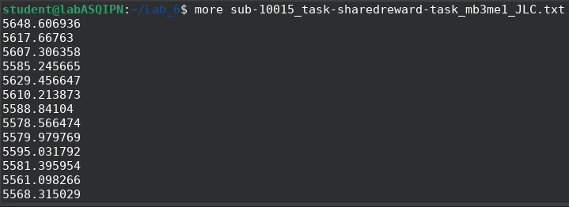

**Note**: you can also run this type of command on specific regions from your L1 activation results (e.g., L1 activation.feat/cluster_mask_zstat1.nii.gz) without doing any additional normalization/registration. For example, if you wanted the second cluster from your cluster_mask_zstat3.nii.gz file, you would run the following command (review your FEAT output and look at these images in fslview if this step does not make sense): 

```bash
fslmaths cluster_mask_zstat3.nii.gz -thr 2 -uthr 2 cluster2 -bin
```

---

## Setting Up PPI Analyses in FEAT

### 5.1 Open FEAT

```bash
Feat &
```
Keep the default settings of First-level analysis and Full analysis are selected at the top of the Feat window.

### 5.2 Data Tab

- Load BOLD data:  
  `~/ds005085/sub-10015/func/sub-10015_task-sharedreward_acq-mb3me1_bold.nii.gz`
- Name output directory: `/home/student/Lab_6/OUTPUT.feat`

---

### 5.3 Pre-stats Tab

- MCFLIRT for Motion correction 
- BET for brain extraction 
- 5 for spatial smoothing FWHM (mm)
- Highpass for Temporal filtering
- MELODIC ICA data exploration turned on (we will compare this output with feat outputs) 


Note that in your report.html output under the pre-stats section you should also see a link for MELODIC Data Exploration. Click on that link and view the output. You should see that MELODIC has reduced your data into a set of components (think back to the lecture and textbook and ask questions if this isn’t clear). Some of the spatial maps and time courses may resemble what you see in your GLM results. 


### 5.4 Registration Tab

- Structural: `~/ds005085/sub-10015/anat/sub-10015_T1w_bet.nii.gz`  
- Linear options: Use BBR and standard MNI defaults

- Standard space option: Leave as default  (MNI152_T1_2mm_brain)
- Linear options: Use Normal search and 12 DOF.
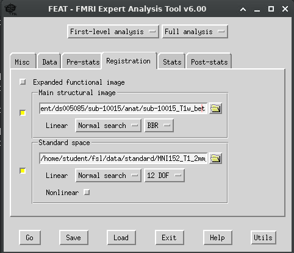
---

### 5.5 Stats Tab

Set **Number of EVs** to **5** and configure as follows:
1. Click the EV1 tab and make the following selections: 
- EV name: Left
- Basic shape: Custom (3 column format)
- Filename: Select the folder icon and navigate to: /home/student/ds005085/sub-10015/func/_guess_allLeftButton.txt
- Convolution: Double-Gamma HRF
- DE-SELECT the option "Add temporal derivative"
  
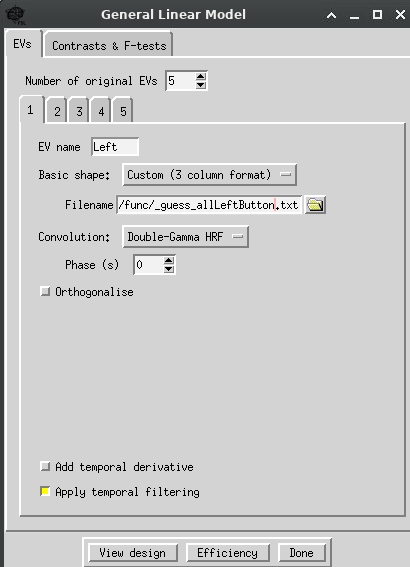

2. Click the EV2 tab and make the following selections: 
- EV name: Right
- Basic shape: Custom (3 column format)
- Filename: select the folder icon and navigate to /home/student/ds005085/sub-10015/func/_guess_allRightButton.txt
- Convolution: Double-Gamma HRF
- DE-SELECT the option "Add temporal derivative"
  
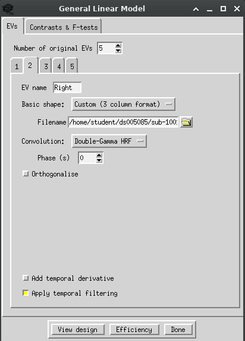

3. Click the EV3 tab and make the following selections: 
- EV name: Phys
- Basic shape: Custom (1 column entry per volume format)
- Filename: select the folder icon and navigate to ~/Lab_6/sub-10015_task-sharedreward-task_mb3me1_JLC.txt
- Convolution: NONE
- DE-SELECT the option "Add temporal derivative" & “Apply temporal filtering”

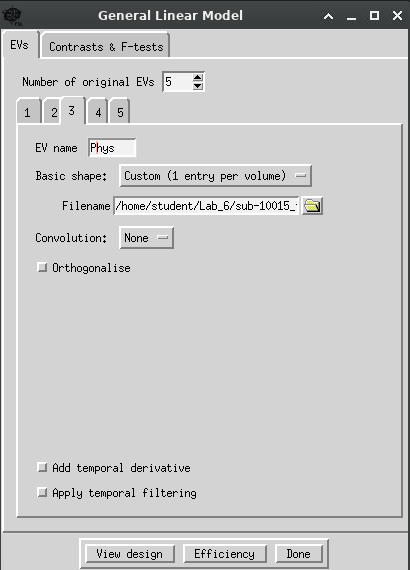

4. Click the EV4 tab and make the following selections:
- EV name: PPI_Left
- Basic shape: Interaction
- Between Evs: 1 & 3
- Make zero: min, min, mean
- DE-SELECT the option "Add temporal derivative"
  
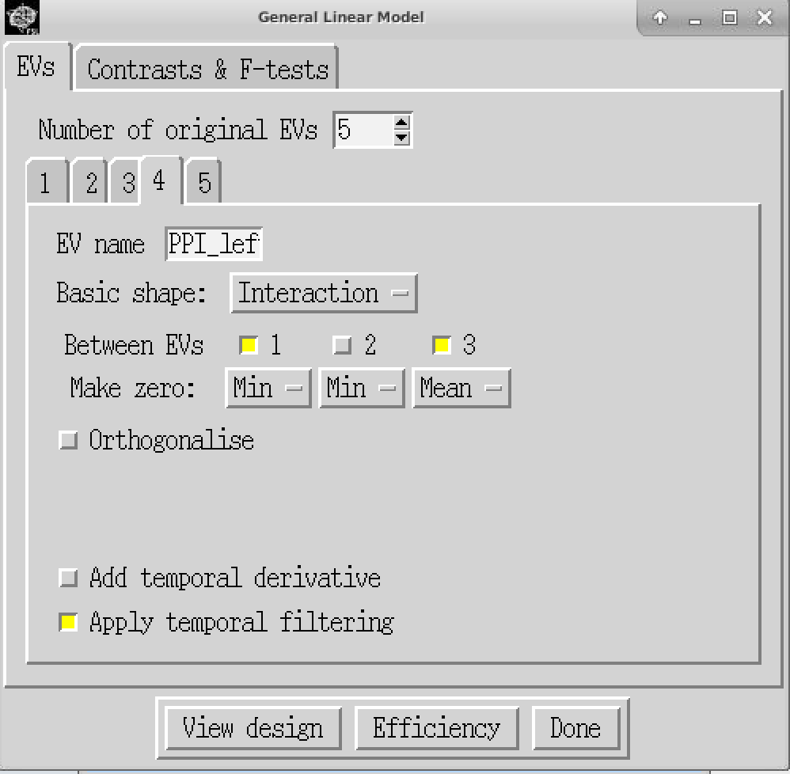


5. Click the EV5 tab and make the following selections: 
- EV name: PPI_Right 
- Basic shape: Interaction 
- Between Evs: 2 & 3 
- Make zero: min, min, mean, min 
- DE-SELECT the option "Add temporal derivative"
 
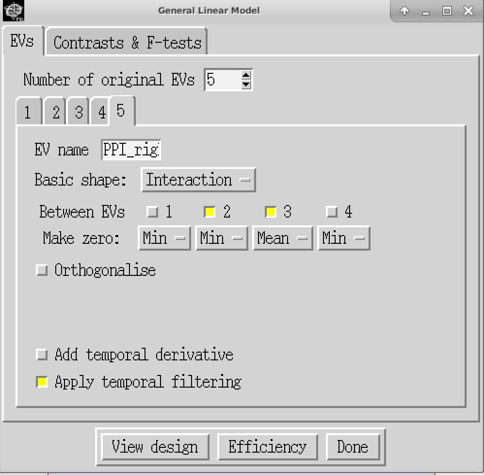

---

### 5.6 Contrasts Tab

Set **10 contrasts**. Fill based on course materials.

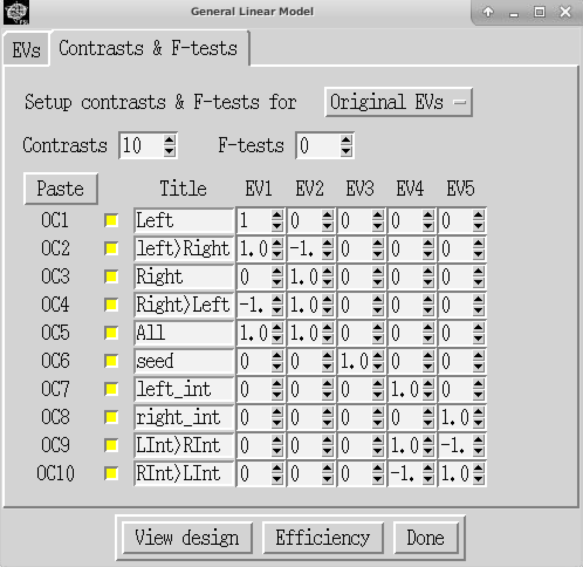
Select Done. A window displaying the model should pop up. The design matrix should look as follows:

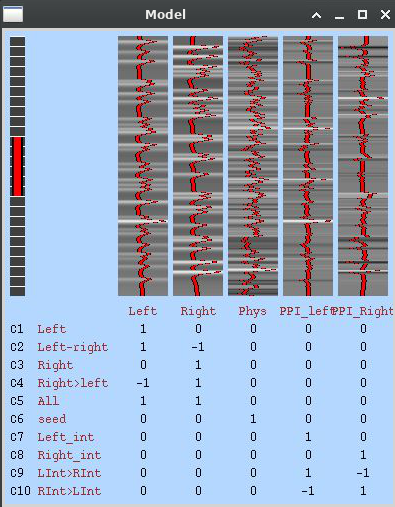

Close the window

## Post-Stats Tab

Leave the default settings. Check that they are the same as in the picture below.  Press Go on the bottom left to run the analysis

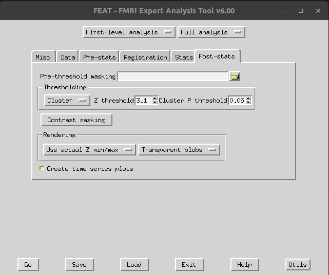

View output:
```bash
microsoft-edge /home/student/Lab_6/OUTPUT.feat/report.html &
```

---

## Summary of Exercises

### Q1
What do you expect to see in the output brain image for the **Phys** regressor (Contrast 6)? Explain your rationale.

### Q2
How would the interpretation of **PPI_Left** and **PPI_Right** change without the **Phys** regressor? Or without the task regressors?

### Q3
Rerun PPI with a different seed region. How do results differ from the SMA seed (focus on Contrast 6-10)?

### Q4
Compare MELODIC ICA outputs to GLM post-stats. What stands out?

---
